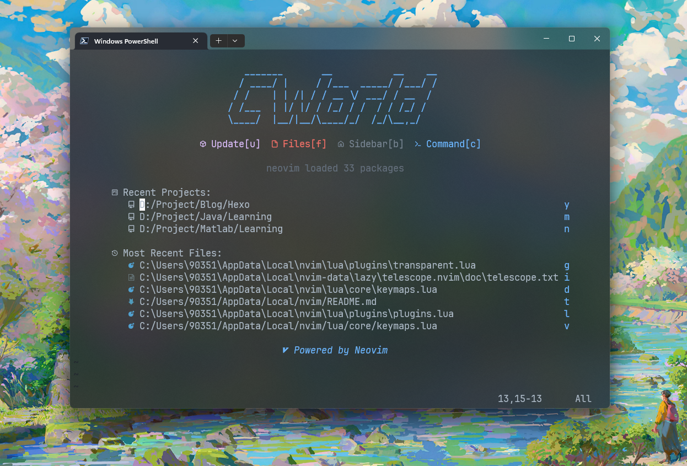
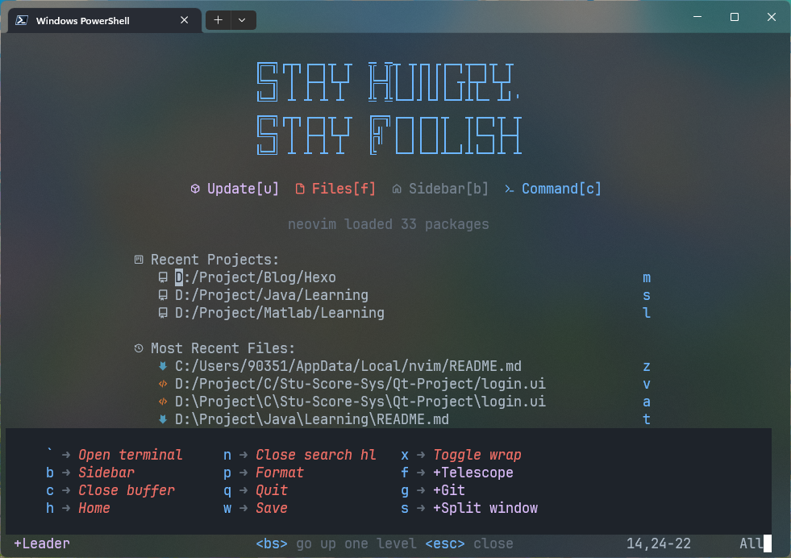
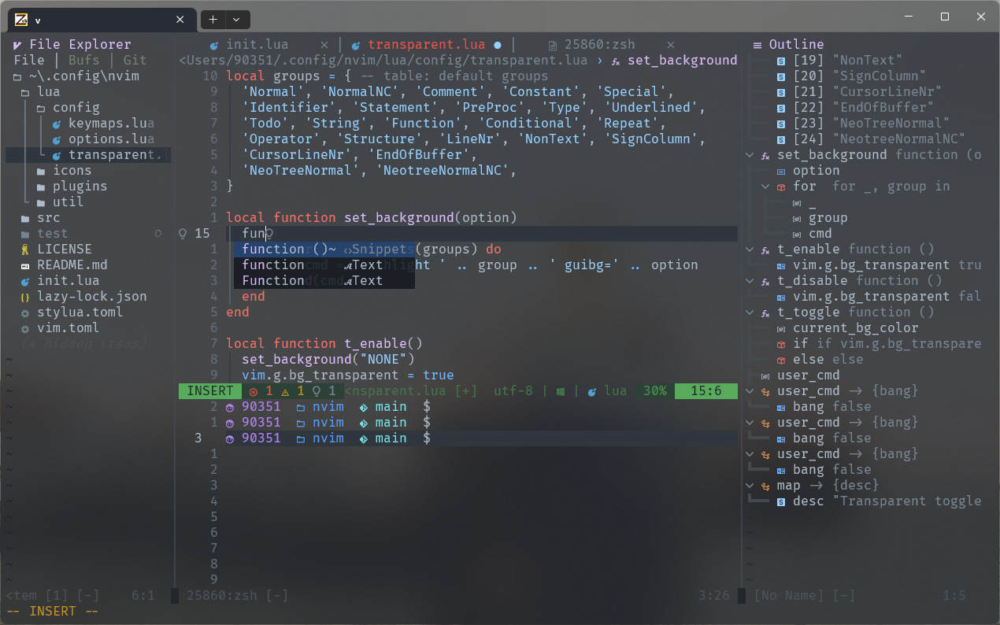
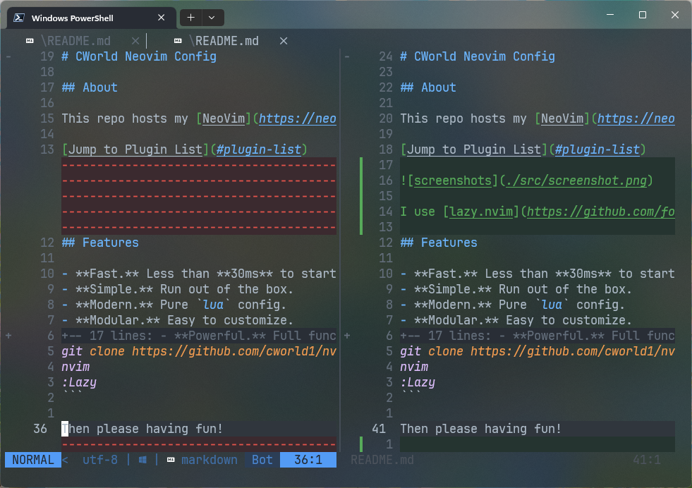
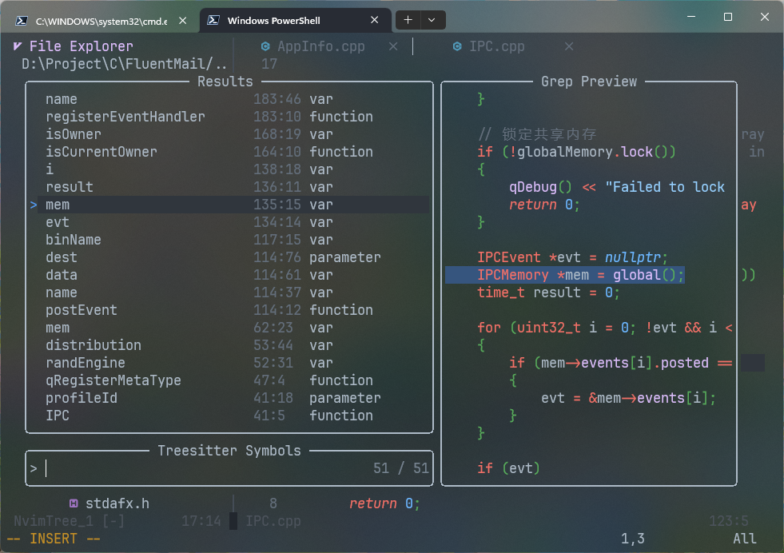

# CWorld Neovim Config

## About

This repo hosts my [NeoVim](https://neovim.io/) configuration for Linux, macOS, and Windows. `init.lua` is the config entry point.



I use [lazy.nvim](https://github.com/folke/lazy.nvim) to manage plugins.

## Features

- **Fast.** Less than **30ms** to start (Depends on SSD and CPU).
- **Simple.** Run out of the box.
- **Modern.** Pure `lua` config.
- **Modular.** Easy to customize.
- **Powerful.** Full functionality to code.

## Installation

Making sure you've installed [NeoVim](https://neovim.io/).

_For Windows:_

```bash
git clone https://github.com/cworld1/nvim-config.git ~/AppData/Local/nvim
nvim
:Lazy
```

_For \*nix:_

```bash
git clone https://github.com/cworld1/nvim-config.git ~/.config/nvim
nvim
:Lazy
```

Then please having fun!

## Screenshots

Home:



File Explorer & code & LSP:



Git support:



Find symbol & file & help:



## Mappings

Pressing <kbd>Space</kbd> in normal mode will show you some parts of the keybindings.

And many more. See [`Keymaps`](lua/core/keymaps.lua) for more.

## Installing Custom Plugins

Goto [`lua/plugins/plugins.lua`](lua/plugins/plugins.lua) and add in the config. Like this:

```lua
require('lazy').setup {
  -- Previous plug-in configuration
  -- ...
  {
    'nvim-telescope/telescope.nvim', branch = '0.1.x',
    dependencies = 'nvim-lua/plenary.nvim'
  }
}
```

## Plugin List

Goto [`lua/plugins/plugins.lua`](lua/plugins/plugins.lua) for details.

## Contributions

As the author is only a beginner in learning it, there are obvious mistakes in his notes. Readers are also invited to make a lot of mistakes. In addition, you are welcome to use PR or Issues to improve them.

## License

This project is licensed under the GPL 3.0 License.
