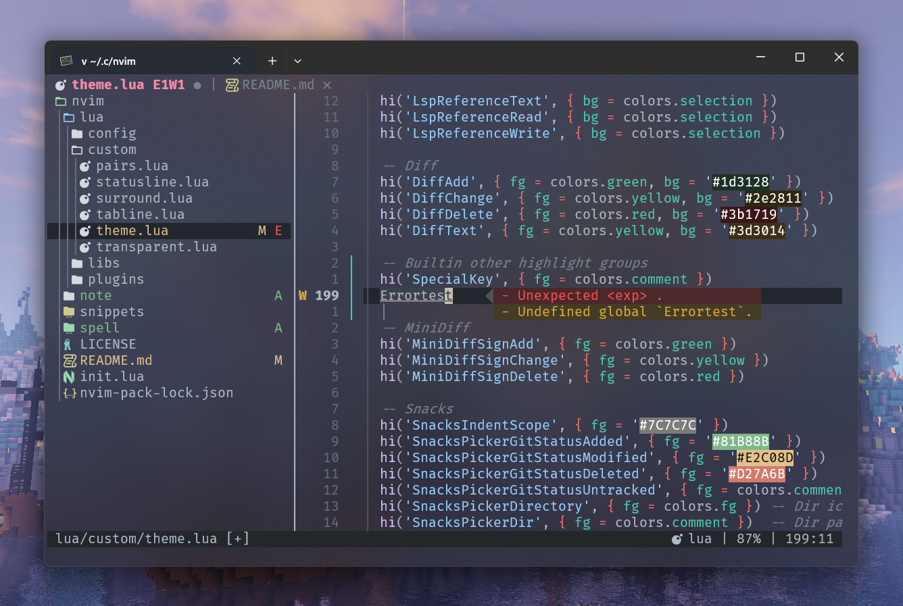
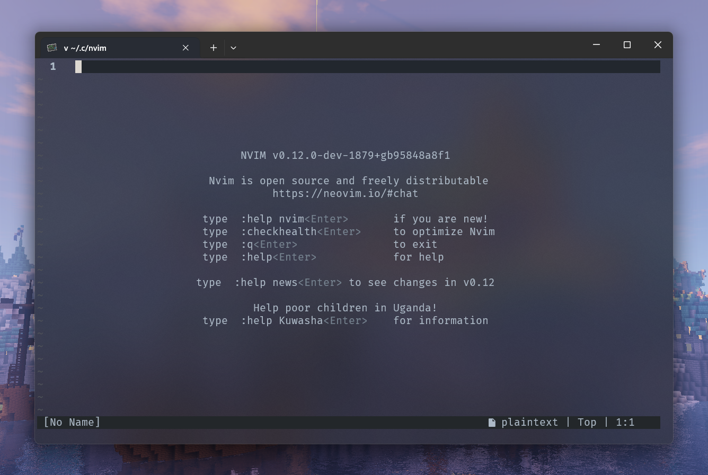
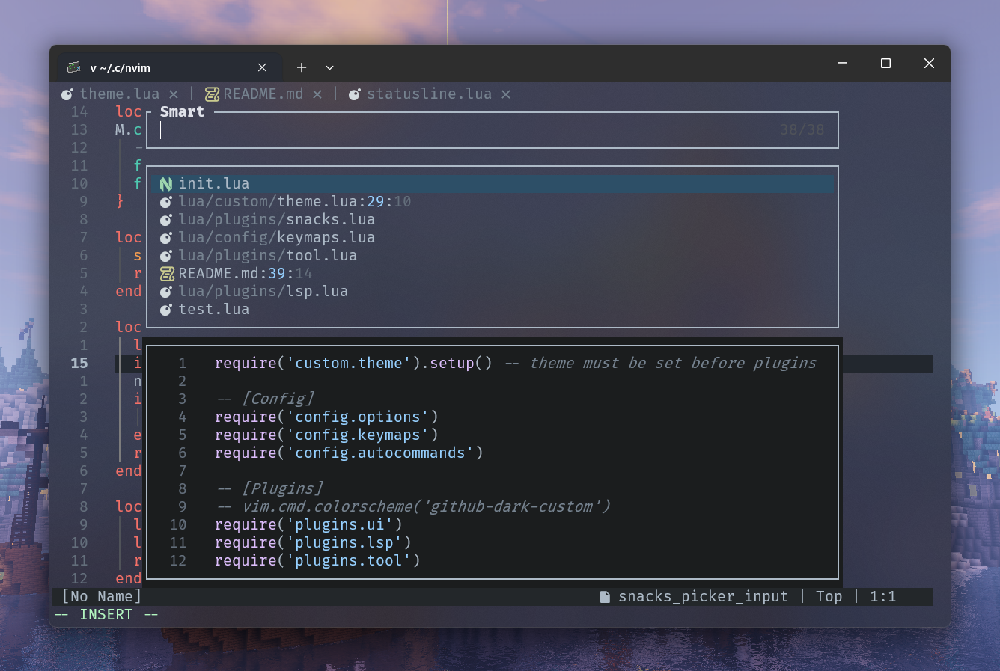

# CWorld NeoVim Config

## About

This repo hosts my [NeoVim](https://neovim.io/) configuration for Desktop environment.



|  |  |
| --------------------------------------------------------- | --------------------------------------------------------- |

## Features

- **Fast.** Less than **30ms** to start (Depends on SSD and CPU).
- **Simple.** Run out of the box with only 12 plugins.
- **Modern.** Pure `lua` config.
- **Modular.** Easy to customize.
- **Powerful.** Near full functionality to code.
- **Beautiful.** Deeply integrated with `snacks.nvim`.

## Info

- Plugin manager: `vim.pack`
- Language server protocol: `nvim-lspconfig`
- Leader key: `Space`

## Installation

Making sure you've installed [NeoVim 0.12](https://github.com/neovim/neovim/releases).

_For Windows:_

```bash
git clone https://github.com/cworld1/nvim-config.git ~/AppData/Local/nvim
nvim
```

_For \*nix:_

```bash
git clone https://github.com/cworld1/nvim-config.git $XDG_CONFIG_HOME/nvim
nvim
```

Then:

1. Open and wait for plugins download.
2. Edit `lua/plugins/lsp-config.lua` for your needs.
3. Reload NeoVim and use `:Mason` to install language dependencies.

Then please having fun!

## Project Structure

- `lua/config`: basic settings
- `lua/custom`: custom tools & functions
- `lua/libs`: shared libraries
- `lua/plugins`: plugin configurations
- `snippets/*`: code snippets
- `init.lua`: entry point

## Contributions

As the author is only a beginner in learning it, there are obvious mistakes in his notes. Readers are also invited to make a lot of mistakes. In addition, you are welcome to use PR or Issues to improve them.

## License

This project is licensed under the Apache 2.0 License.
